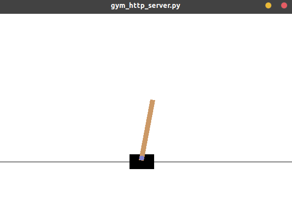

# gym-http-api(binding-cpp)

C++ binding of [Official package](https://github.com/openai/gym-http-api)
was not easy to use for beginner. 
So, I arrenged those package such as adding CMakeLists.txt and so on.

This package allow you to installing with few steps.

### Installation

1. Download harumo11/binding-cpp
2. Replace openai/gym-http-api/binding-cpp directory with harumo11/binding-cpp directory.
3. Build a library controlling OpenAI-Gym from C++.
	```sh
	cd binding-cpp/lib
	mkdir build
	cd build
	cmake ..
	make 
	sudo make install
	```

4. Building a program which uses built library.
	
	```sh
    cd ../agent
    mkdir build
    cd build
    make 
	```
	
5. Checking whether built program can control OpenAI-Gym

	1. Run a OpenAI-Gym server
		
		```sh
		cd opt/gym-http-api
		python3.6 gym_http_server.py
		```
	2. Run a C++ client program
		
		```sh
		cd binding-cpp/agent/build
		./random_agent
		```

		You should see like following picture.

		


### Explanation of library

- `Gym::Client`
	This class represents client
	
	- `Gym::Environment make( const std::string &name)`
	
	  This member function creates environment.
	
	  - `std::string& name` : environment name (e.g. "CartPole-v0").
	  - `Gym::Environment` : This *returned* class represents environment.
	
- `Gym::Environment`

  This class represents environment.

  - `Gym::Space action_space()`

    Return action space.

    - `Gym::Space` : This *returned* class represents action space.

  - `Gym::Space observation_space()`

    Return observation space.

    - `Gym::Space` : This class represents observation space.

  - `void reset( Gym::State *save_initial_state_here)`

    Reseting the state and initial state can be observed as argument.

    - `Gym::State* save_initial_state_here`

      save_initial_state_here variable will get initial state.

      ```c++
      Gym::State s;
      env->reset(&s);e
      ```

- `Gym::State`

  This class represents **state** of environment.

  - `bool done`
  - `std::string info`
  - `std::vector<float> observation`
  - `float reward`